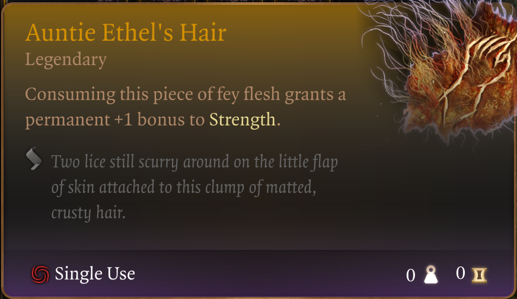
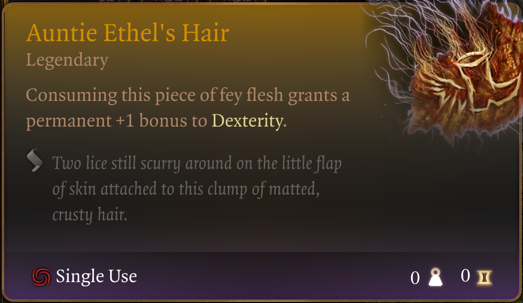
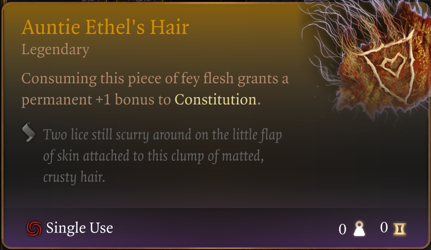
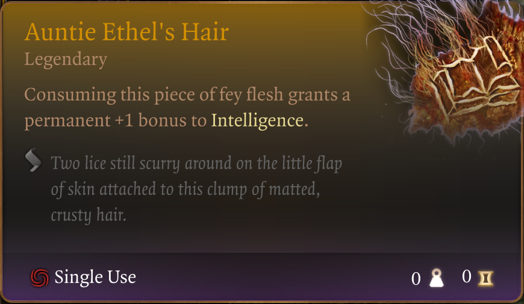
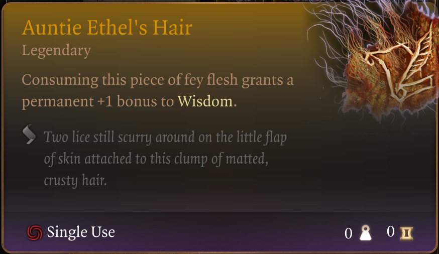
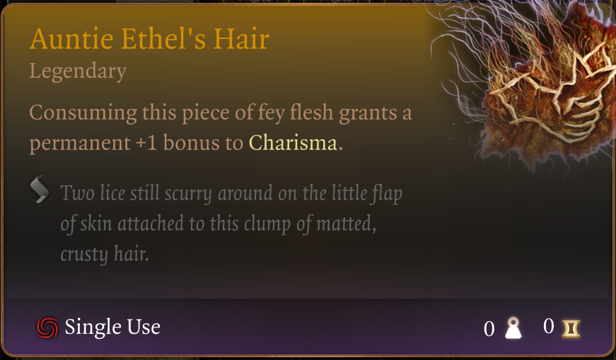

# The Disgusting Hair of Auntie Ethel

Before anyone says it; is this cheaty?   Yes. Yes, it is!

I made this mod to overcome what I see as a pretty fundamental problem in Baldur's Gate 3, the unique quest rewards. It's not that I have a better solution on hand to propose, I just know that I don't really like them the way they work now either.

Specifically, when it comes to a quest reward like this here - the hair of Auntie Ethel. If you're playing with friends in MP, who gets it?   Presumably everyone contributed to bringing the old hag down, why should only one party member get rewarded?

To work around this problem, I've cooked up a bag of her hair. The INTENDED use for this is in Multi-Player, after bringing down the hag and negotiating with her, the "Face of the party" player will be able to pick 1 of these as a reward. And that's it. This is where - to keep things fair and balanced - other players in your MP party should pop this in, and select a reward for themselves.

That said - I'm not here to tell anyone how to play :D

Fact is; how you use this mod is of course entirely up to you.  A few questions that might pop up:

### Does this interfere with the actual quest reward?
It shouldn't. The items included here are copies.

### Can I consume all of them?
Yep.

### Can I consume all of them more than once?
I mean it LOOKS like it. I saw my stats going up, but only 1 status effect (of each type) gets applied. I guess the answer is "maybe".

### This is cheating
Yea, but I mean, so is any mod that isn't purely cosmetic. If you don't like it, don't use it :D

Once installed, you will find the following in the Tutorial Chest; a Legendary backpack named "The Disgusting Hair of Auntie Ethel".

## Strength

## Dexterity

## Constitution

## Intelligence

## Wisdom

## Charisma

In the hope that friendships can be saved and BG3 Multi-Player enjoyed more, this is my gift to you.

For for now, this is it. This is the mod.
