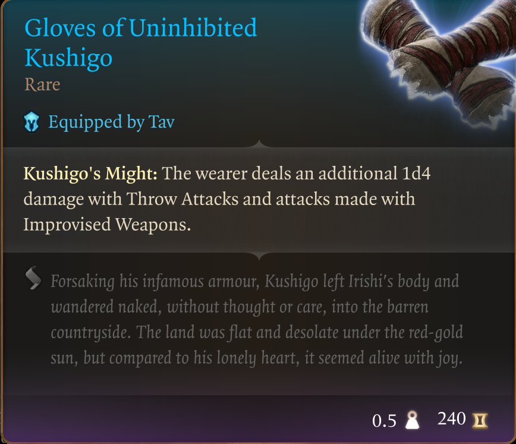

# The Way of Kushigo

Published on Nexus Mods: [The Way of Kushigo](https://www.nexusmods.com/baldursgate3/mods/3414)

Welcome to my very first mod. For Baldur's Gate 3, and first mod generally.

Having done 10 or more playthroughs by now, I wanted to spice things up a little through the very slowly progressing early game. But I wanted to do so, without actually introducing absurd imbalances and other-worldly (cheaty) equipment to the game. Don't get me wrong, you do you, but having tried some of the massively overpowered armor sets found here on Nexus myself; I found that it not only takes the fun out of the early game... it takes the point out of the game entirely.

In my opinion anyway.

Ok so. All that said, this mod will moderately overpower you as well in the early game. But all of the items here, are actually obtainable at various points in the early game. There are no artificial mods or abilities added; I've simply taken the items that are already obtainable and collected them in a nice bag for you.

I don't think the items here will last you all the way through the end game, nor was that ever my intention. But it will set you off to a good and stylish start.

Once installed, a bag called **The Legacy of Kushigo** will be added to the [Tutorial Chest](https://www.nexusmods.com/baldursgate3/mods/457). Inside you will find the following items:

## Hat of Uninhibited Kushigo

## Armour of Uninhibited Kushigo

## Gloves of Uninhibited Kushigo

## Boots of Uninhibited Kushigo

While certainly very nice, none of them will truly overpower you in the very early game. The boots are likely to stay with you for the entire duration however.

And as a bonus, a few pick-me-up items have been added intended for the late-early to early-mid (whatever this means, lol) game.

## Ring of Free Action

## Garb of the Land and Sky

## Scabby Pugilist Circlet

That's it. That's the mod.