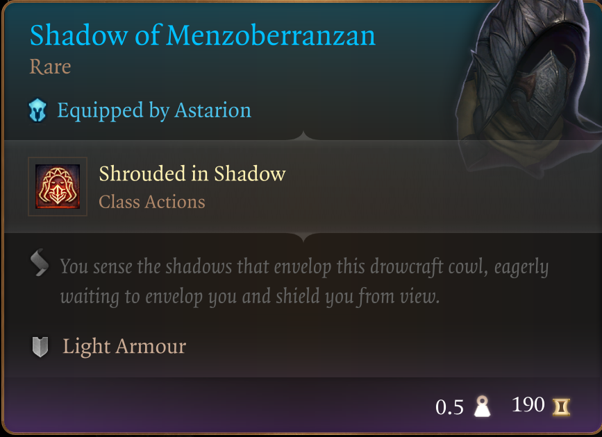
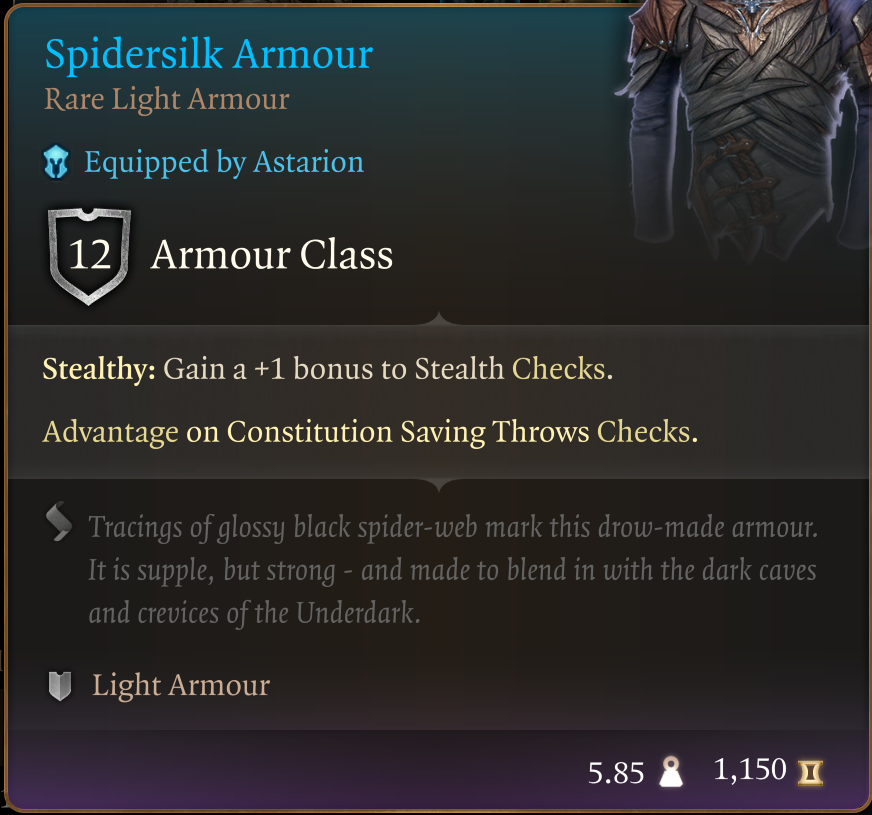
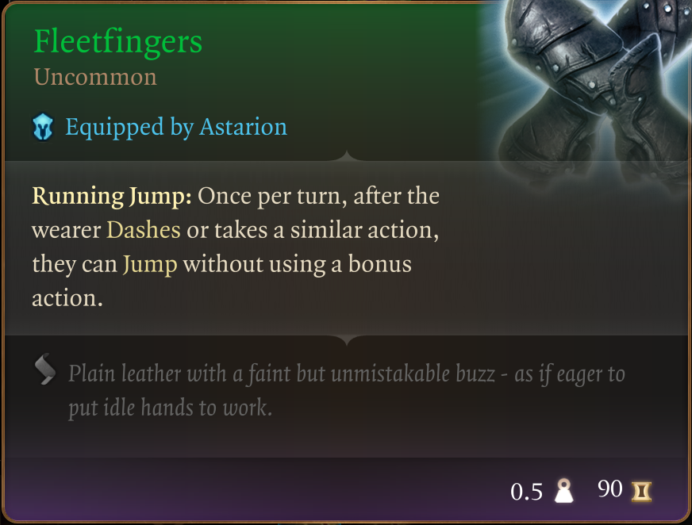
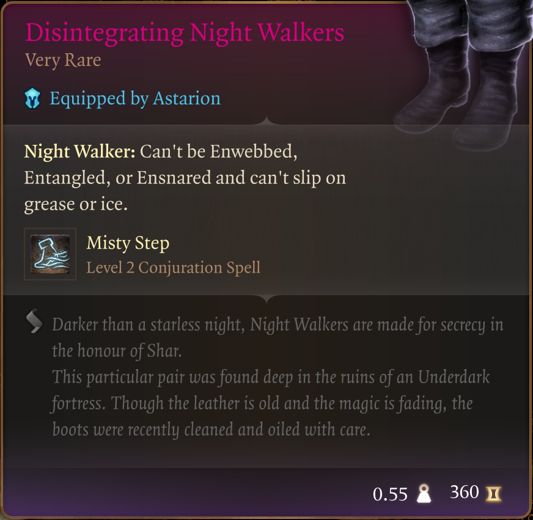
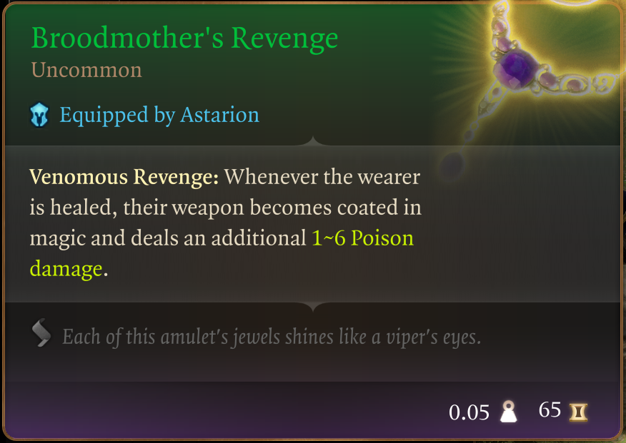
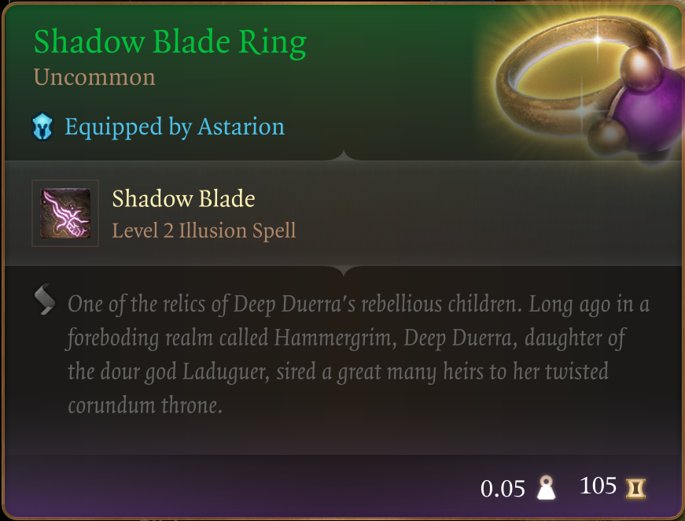
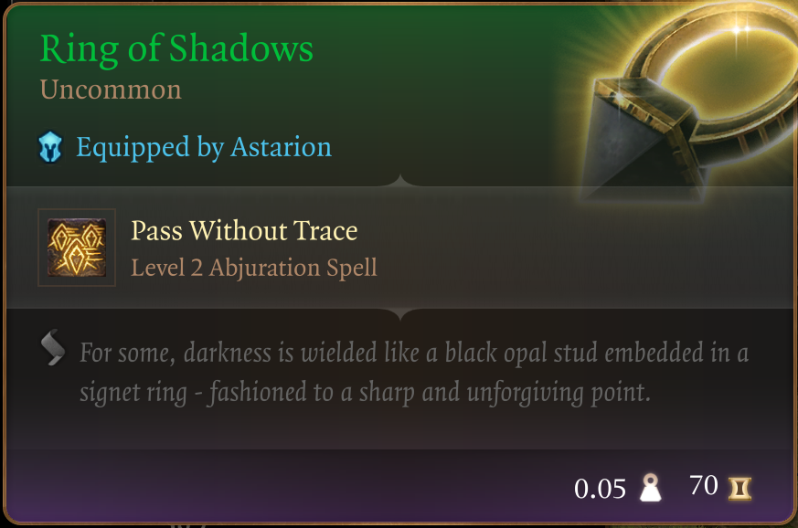
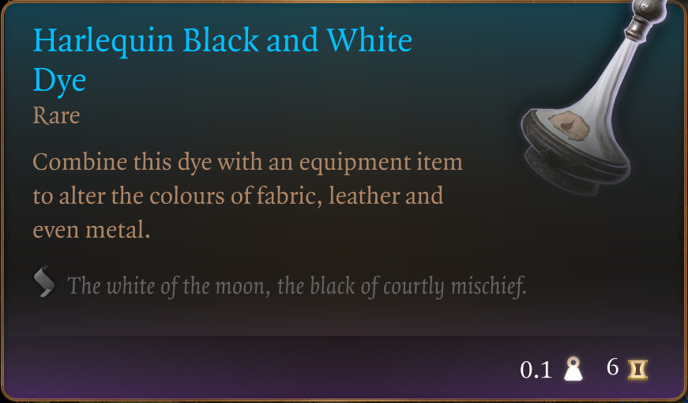
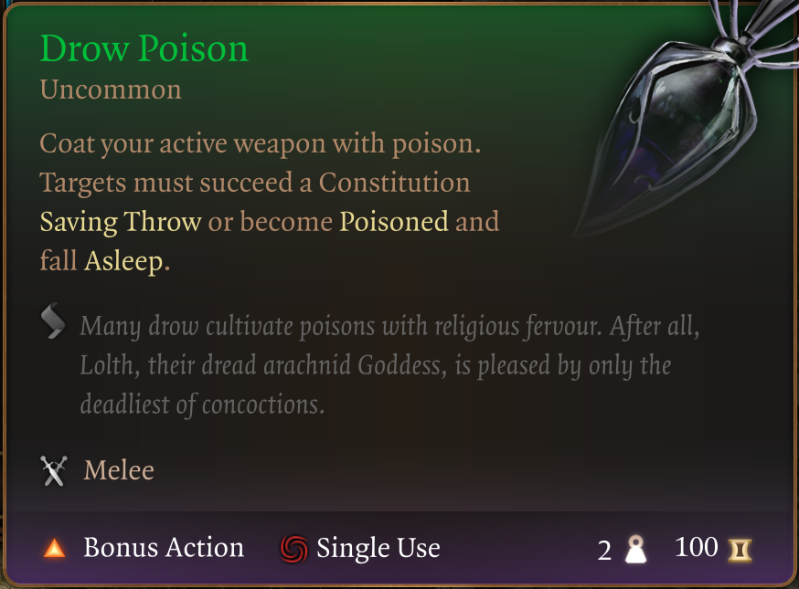
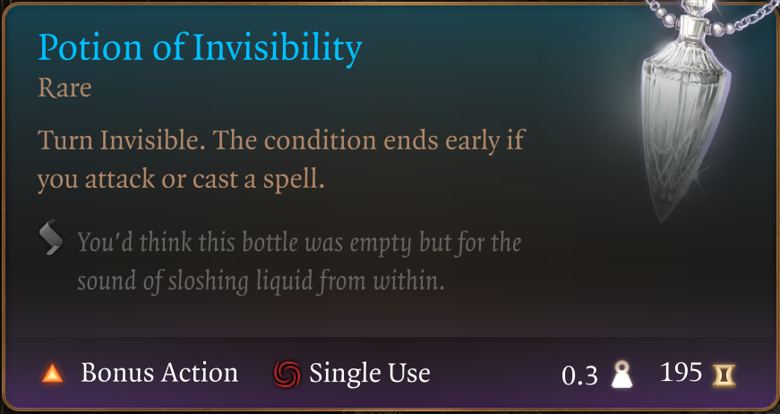

# The Way of The Assassin

Welcome to my sixth mod in a series that doesn't really have a name :D

I'm trying to provide an enhanced starter experience without tossing the balance too much onto the overpowered side. Every item you find in this mod already exists in game and can be found "reasonably early on". So no end game Act 3 weapons and gear here - although some of the items might actually last you all the way to the end game.

This mod focuses on the assassin. Hiding in the shadows, delivering your deadly payload, retreat back in the shadows. Such is the way of the assassin.

This mod introduces a new pack in the Tutorial Chest, a backpack named "The Way of the Assassin". Inside it you will find the following items:

## The Shadow of Menzoberranzan

## Spidersilk Armour

## Fleetfingers

## Disintegrating Night Walkers

## Broodmother's Revenge

## Shadow Blade Ring

## Ring of Shadows

## Harlequin Black and White Dye (5)

## Drow Poison (10)

## Potion of Invisibility (3)

Primarily thought of as a ranged attacker, the Shadow Blade can be utilised when things get up close and personal. The Spidersilk Armour helps keep concentration going for that.

For for now, this is it. This is the mod.
