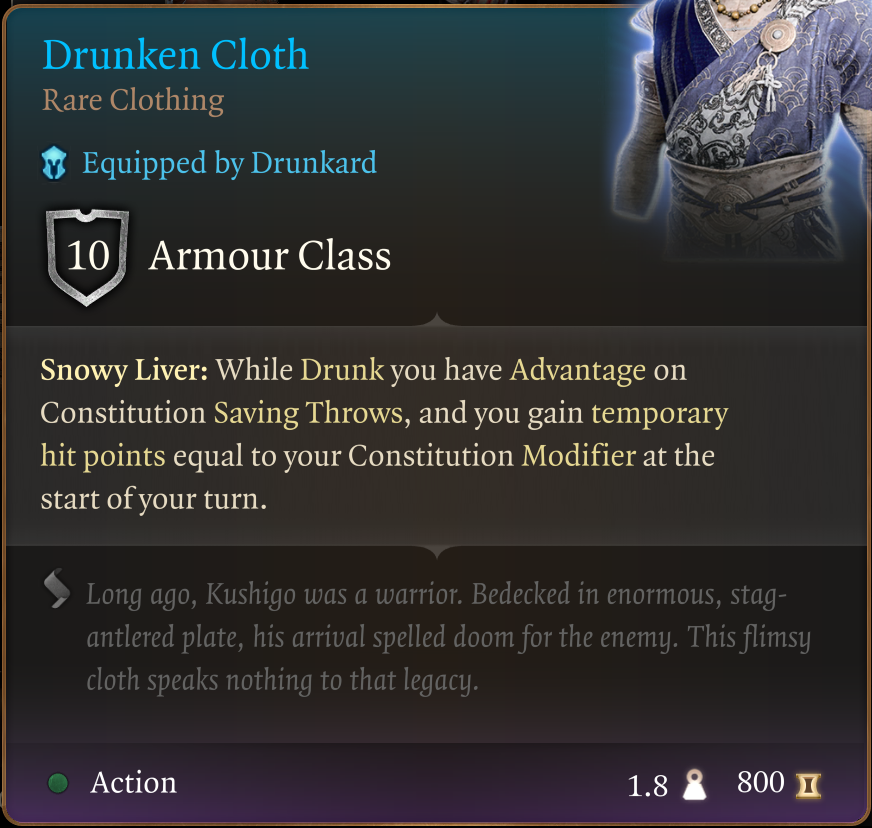
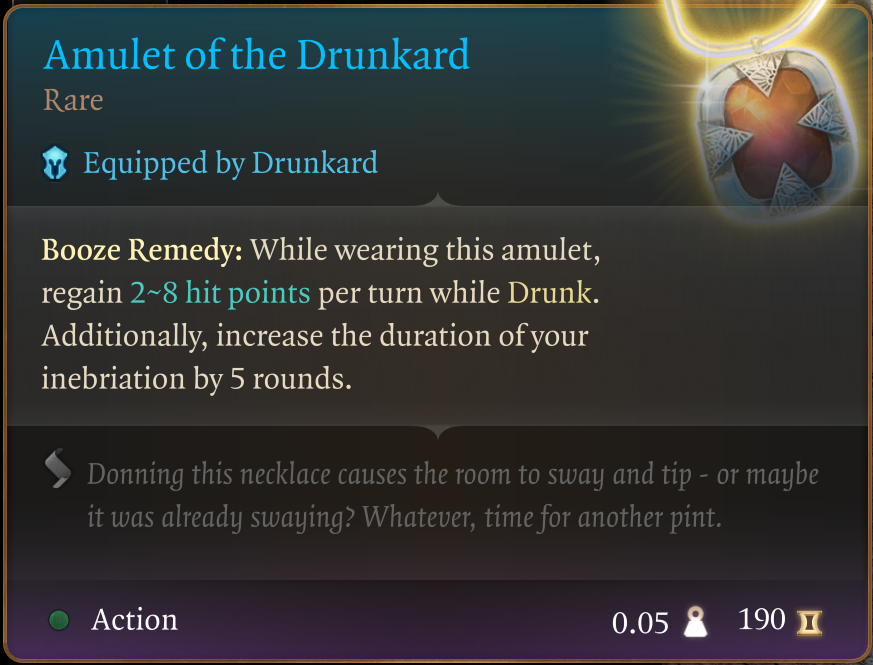
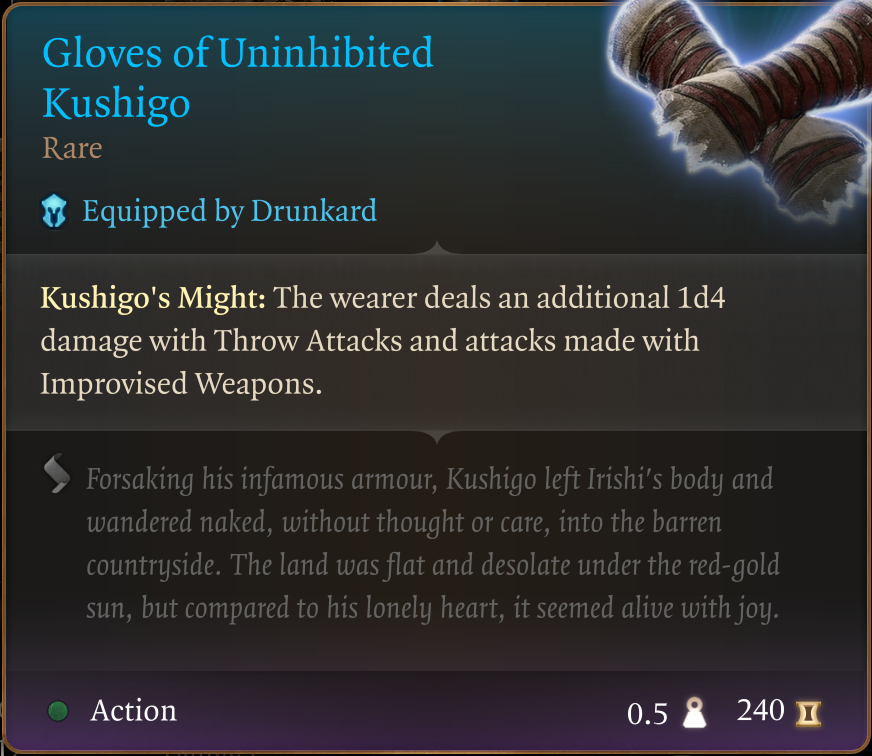
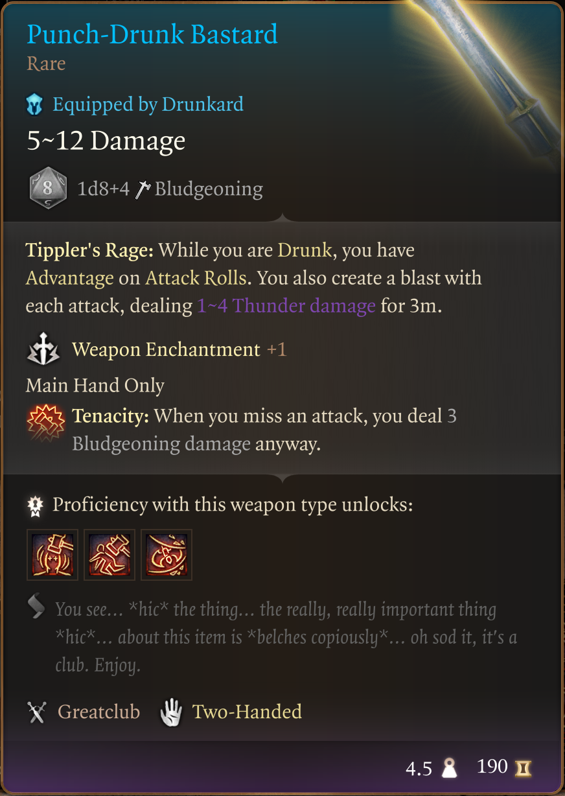
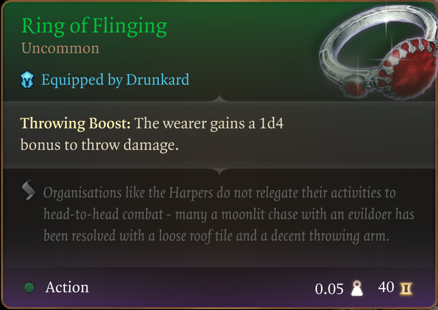
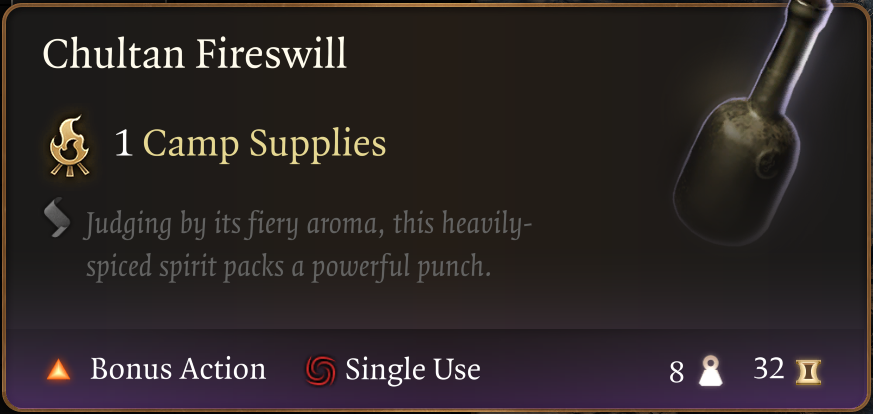
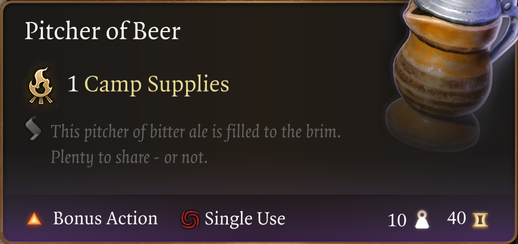
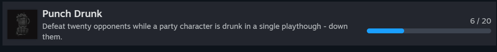

# The Way of The Drunkard

Published on Nexus Mods: [The Way of the Drunkard](https://www.nexusmods.com/baldursgate3/mods/3438)

Welcome to my third mod in a series that doesn't really have a name :D

I'm trying to provide an enhanced starter experience without tossing the balance too much onto the overpowered side. There are no custom items in these mods, all of the items can be found in the game today. I've just collected them for you.

I'm breaking my "usual" rule about only providing early game items for these mods. None of the items here can actually be found early in the game, some of them in Act 2 and some even in Act 3. Which I personally think is silly, as you will be more than "a few" hours into your gameplay by that time and the idea of adopting an entirely new playstyle mid Act 3 isn't all that appealing.

To me, at least.

That said, this also means that these items will overpower you a bit more than I would normally like for starting act 1. I guess the drunken lifestyle is more of a role-playing approach anyway, so no harm done.

This mod introduces a new pack in the Tutorial Chest, a backpack named "The Way of the Drunkard". Inside it you will find the following items:

## Drunken Cloth

## Amulet of the Drunkard

## Gloves of Uninhibited Kushigo (for those late night tavern brawls)

## Punch-Drunk Bastard

## Ring of Flinging (helps when throwing chairs around in a bar fight)

## A decent supply of Fireswill

## A decent supply of Beer

In my mind I had a dwarf/barbarian build for this one. But in reality there are no real build restrictions. That Greatclub is way more overpowered than you might think, I'll leave it to you to discover for yourself why that is.

Be careful not to give all your alcohol to your team mates. If you're not careful, the heartless bastards will drink it all up in a single evening :D

Time to chase that achievement!

