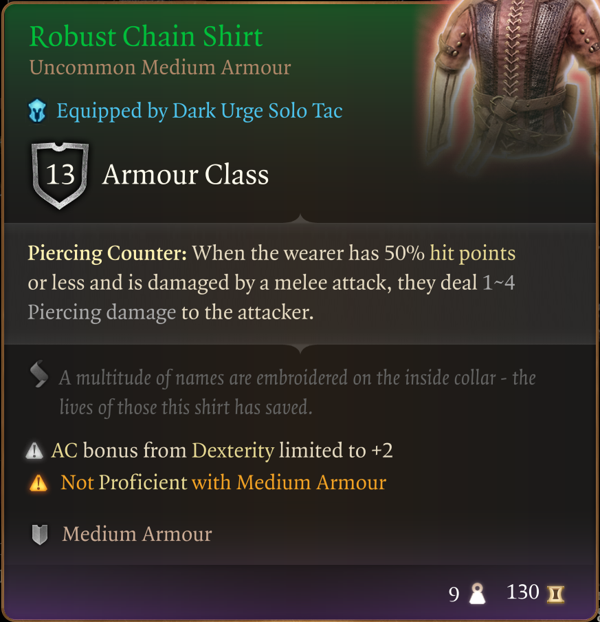
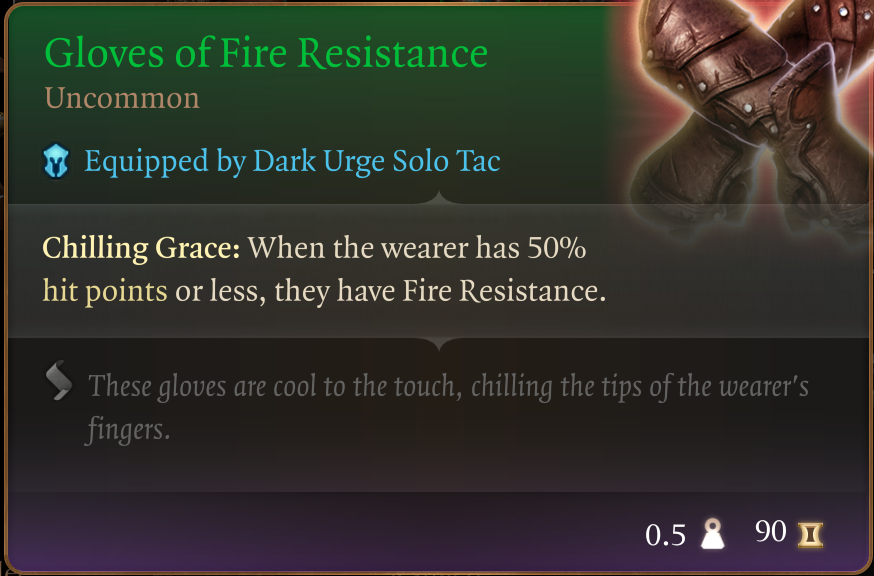
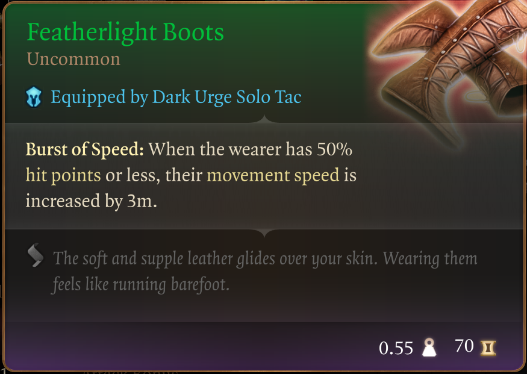
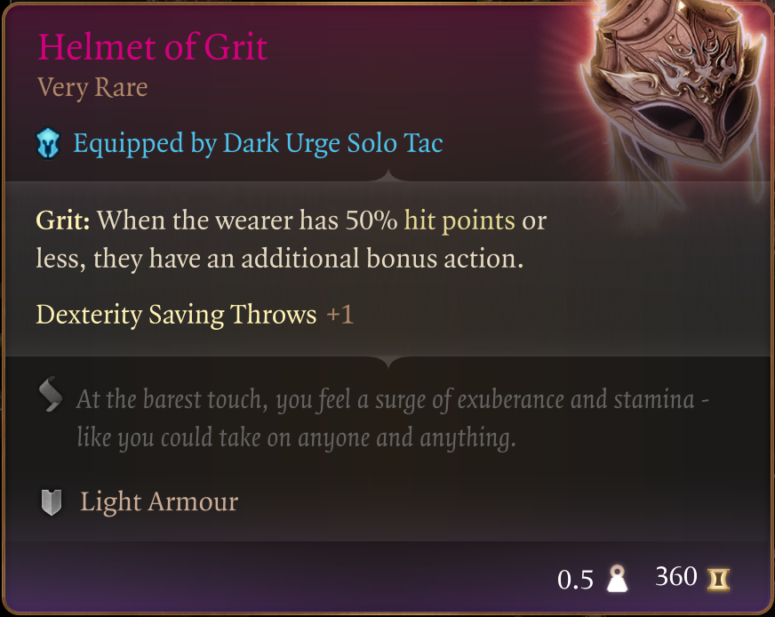
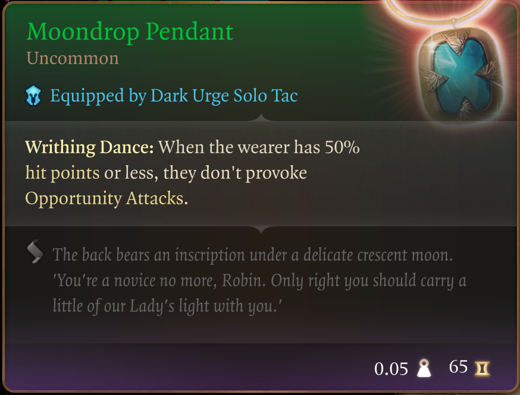
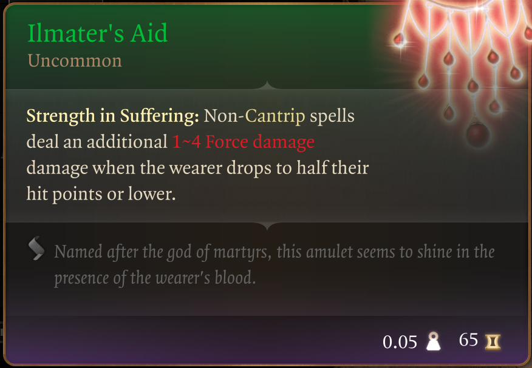
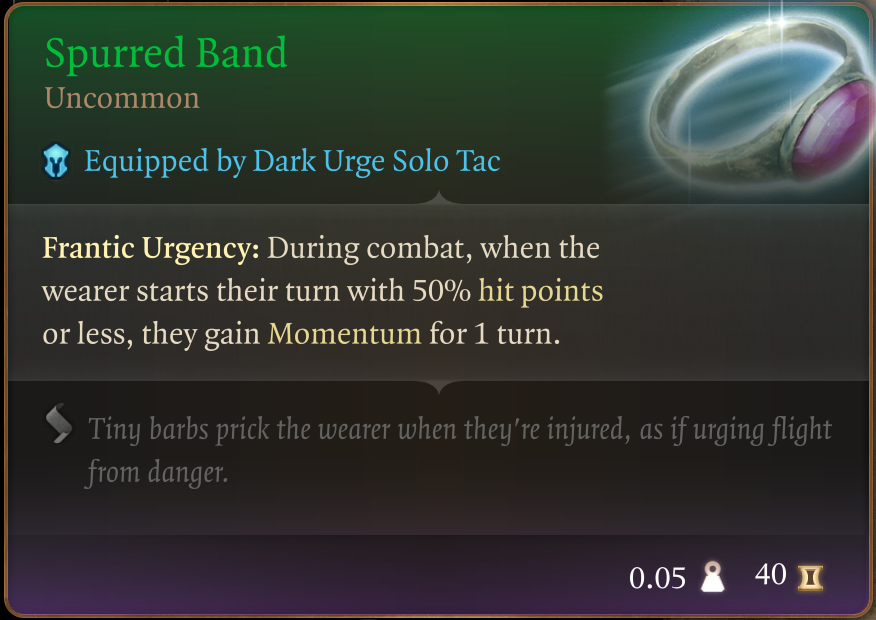
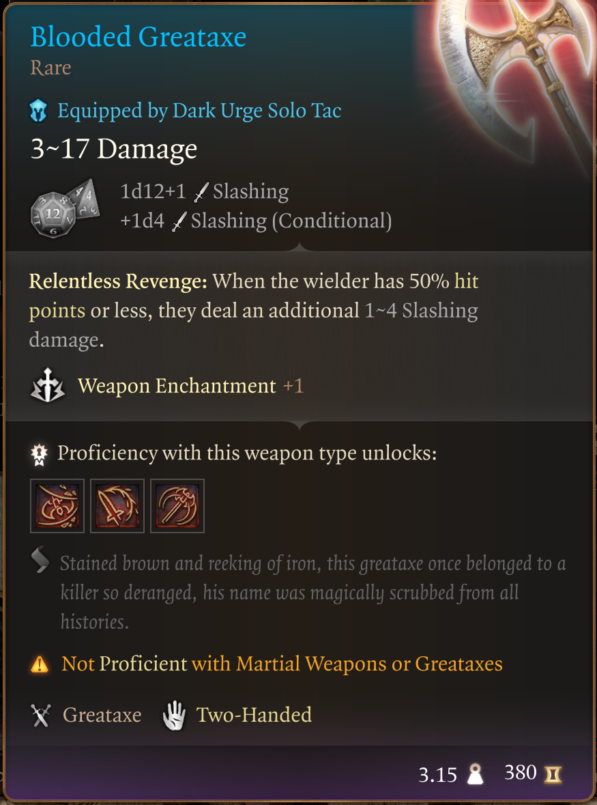
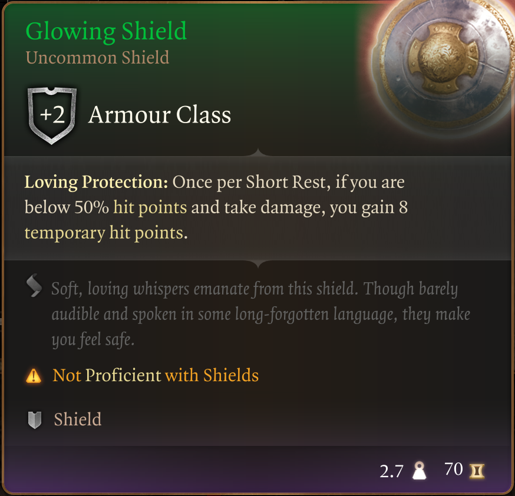

# The Way of The Flaggelant

Welcome to my eighth mod in a series that doesn't really have a name :D

I'm trying to provide an enhanced starter experience without tossing the balance too much onto the overpowered side. There are no custom items in these mods, all of the items can be found in the game today. I've just collected them for you.

So I've been noticing these items in the game, but never really paid all that much attention to them. In other games (Elden Ring, for instance), it was possible to set up some pretty interesting builds, all based on the fact that you yourself was wounded/hurt and running on low HP.

So I decided to gather up these items. The ones I coudl find anyway. And put them together in a pack for you all. What build can you do with these? Nothing. Everything. I honestly don't know, but I would love to see what people come up with.

This mod adds a pack to the Tutorial Chest; "The Way of The Flagellant". Have at it :D

Inside it you will find the following items:

## Robust Chain Shirt

## Gloves of Fire Resistance

## Featherlight Boots

## Helmet of Grit - Breaking my rule of "early game" a bit here, but the use-case for these items is on edge

## Moondrop Pendant

## Ilmater's Aid

## Spurred Band

## Blooded Greataxe

## Glowing Shield

“Accept the pain, but don't accept that you deserved it.” - Brandon Sanderson, Oathbringer

That's it, that's the mod. Enjoy!
