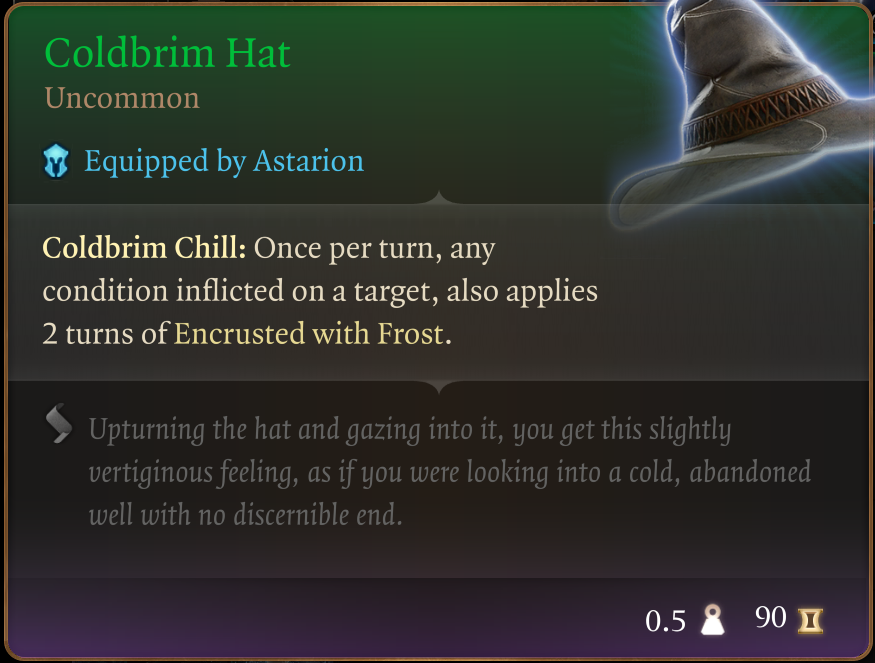
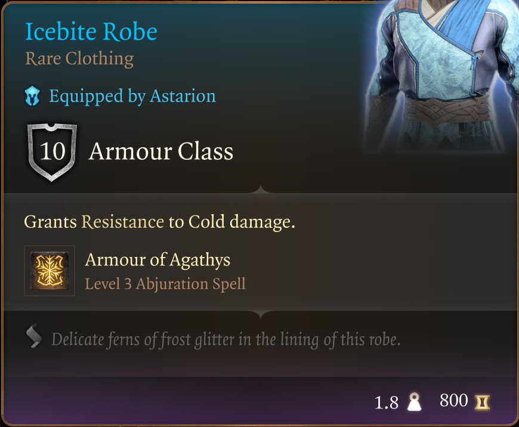
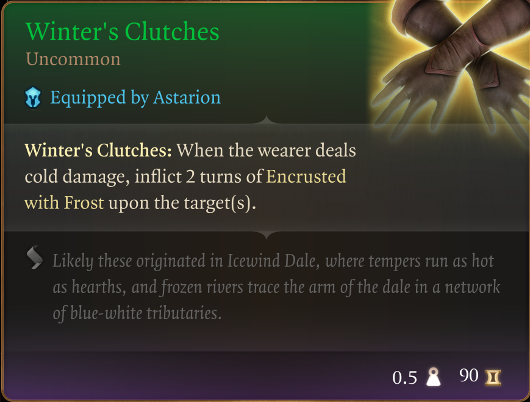
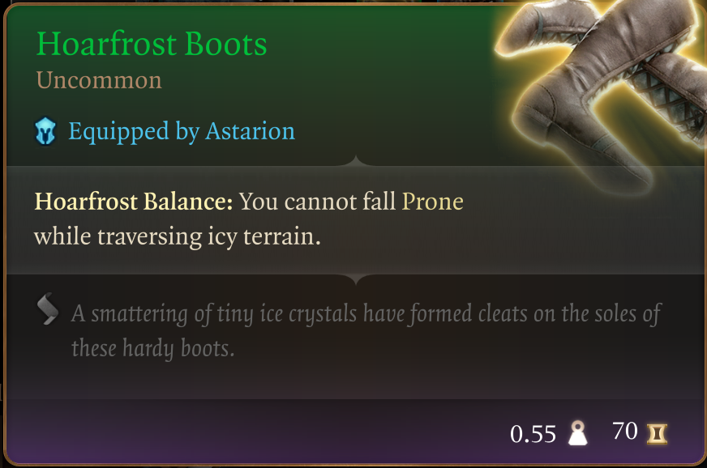
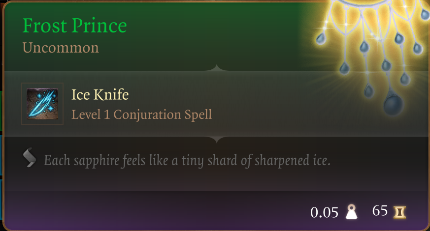
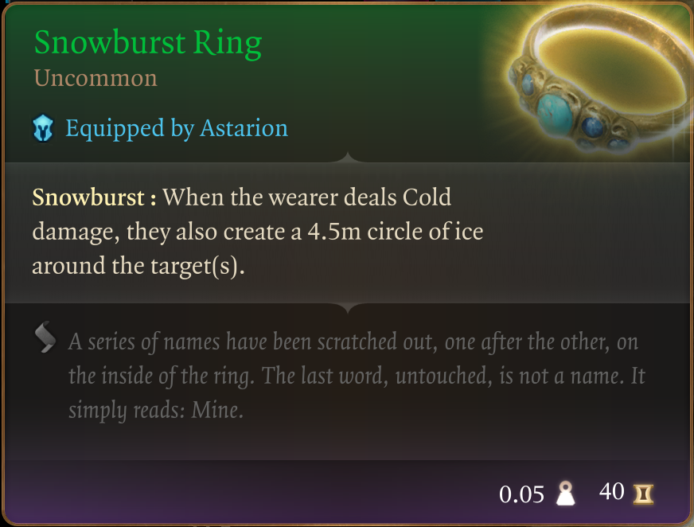
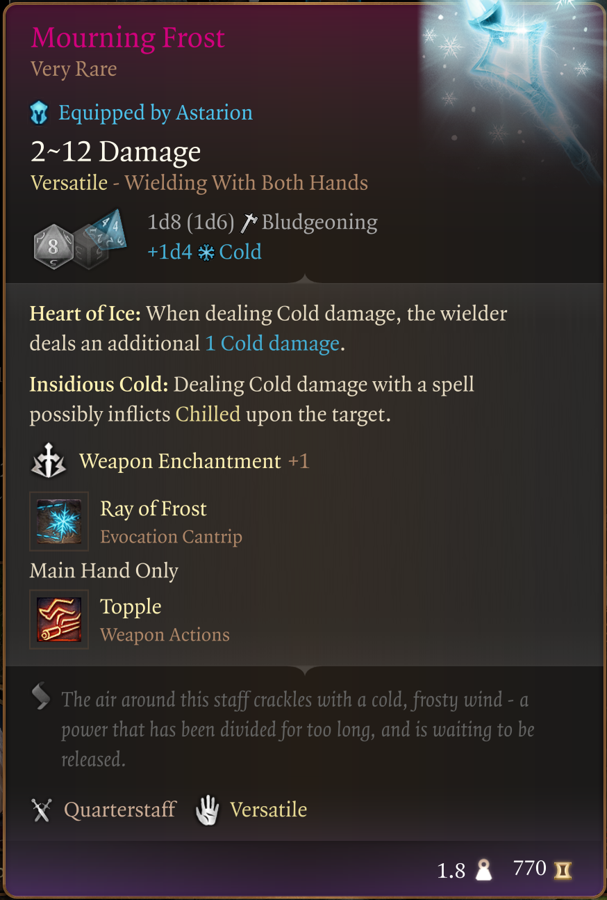
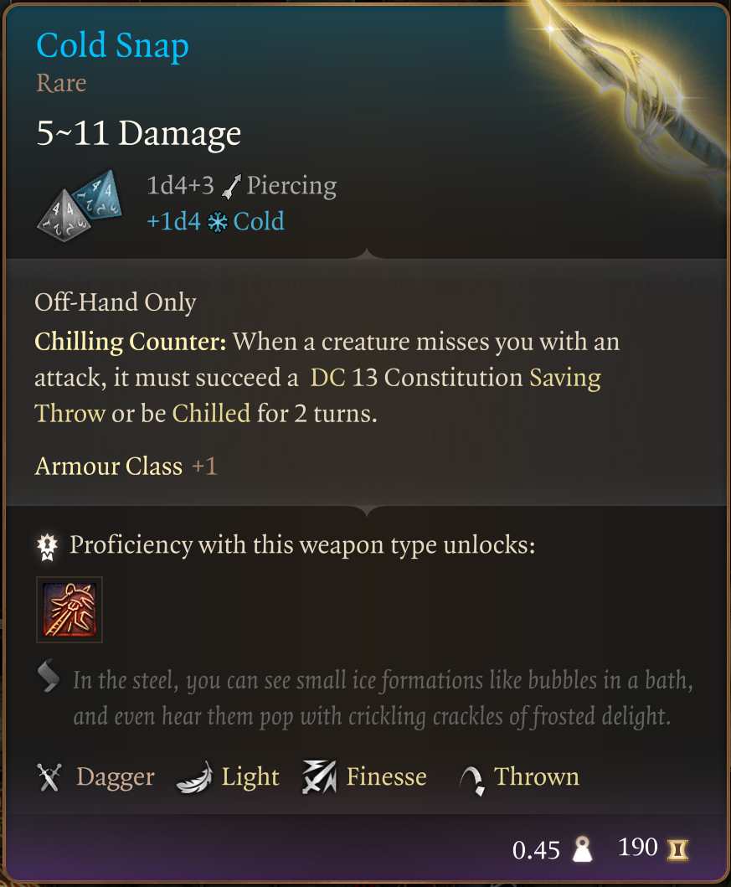
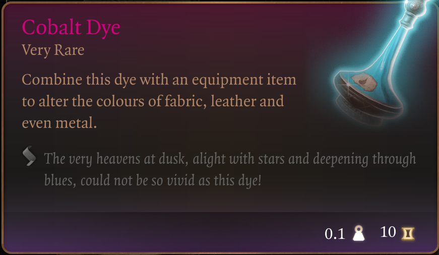

# The Way of The Frigid

Welcome to my seventh mod in a series that doesn't really have a name :D

I'm trying to provide an enhanced starter experience without tossing the balance too much onto the overpowered side. Every item you find in this mod already exists in game and can be found "reasonably early on". So no end game Act 3 weapons and gear here - although some of the items might actually last you all the way to the end game.

This time it's all about the frostbite. Chilling cold, time to put the competition up those Eldritch Blasters :D

This mod introduces a new pack in the Tutorial Chest, a backpack named "The Way of the Frigid". Inside it you will find the following items:

## Coldbrim Hat

## Icebite Robe

## Winter's Clutches

## Hoarfrost Boots

## Frost Prince

## Snowburst Ring

## Mourning Frost

## Cold Snap - You'll need a Feat to equip both weapons

## Cobalt Dye - For your fashion needs

Primarily I see this as a magic user, but most of this gear could definitely be put to use on other builds as well. Have fun with it :D

This is it. This is the mod.
