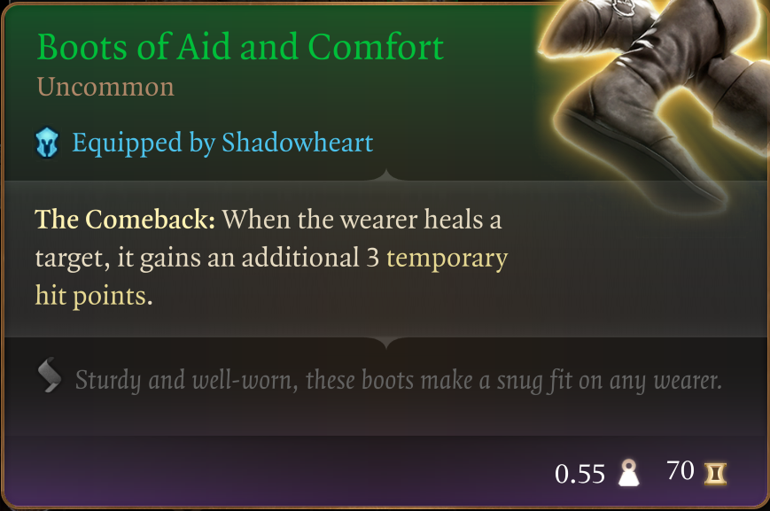
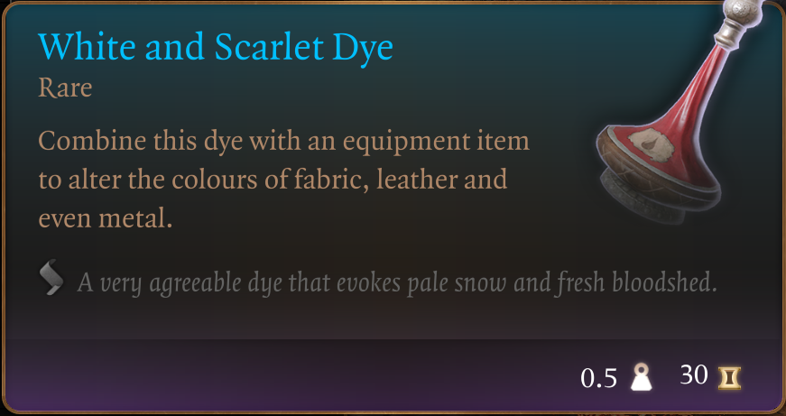

# The Way of The Healer

Welcome to my fourth mod in a series that doesn't really have a name :D

I'm trying to provide an enhanced starter experience without tossing the balance too much onto the overpowered side. There are no custom items in these mods, all of the items can be found in the game today. I've just collected them for you.

Walking the balance between useful for a specific purpose (healer, in this case) and not being too overpowered is not always easy. For this mod, my biggest doubts were about including The Whispering Promise or not. In the end I decided to include it. If you feel it overpowers the whole thing too much, just leave it behind in the Tutorial Chest I guess? :D

The combination of items in this mods turned out to be a regular fashion disaster, so I've included a stack of thematically appropriate dyes to alleviate the situation at least a bit. 

This mod introduces a new pack in the Tutorial Chest, a backpack named "The Way of the Healer". Inside it you will find the following items:

## Amulet of Sylvanus

## Dark Justiciar Mail (the Uncommon one, none of the later OP ones)

## Boots of Speed (for the aspiring emergency medic)

## White and Scarlet Dye (5) - To avoid persecution from the Fashion Police

## Hellrider's Pride

## Wapira's Crown

## Ring of Salving

## The Whispering Promise

The Whispering Promise and Hellrider's Pride can actually be considered end game items, even if they can be obtained reasonably early in the game. If you're worried about balance issues, I'd suggest not putting those on.

That's it, that's the mod. Enjoy!
