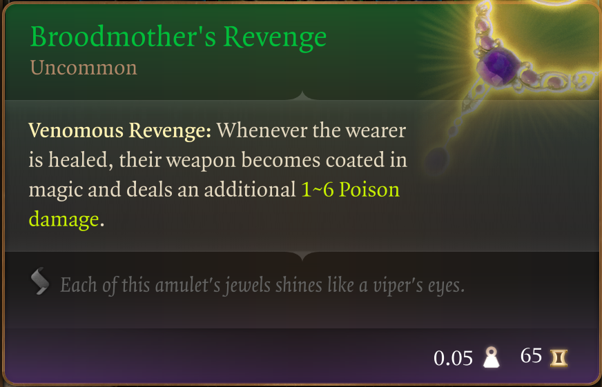
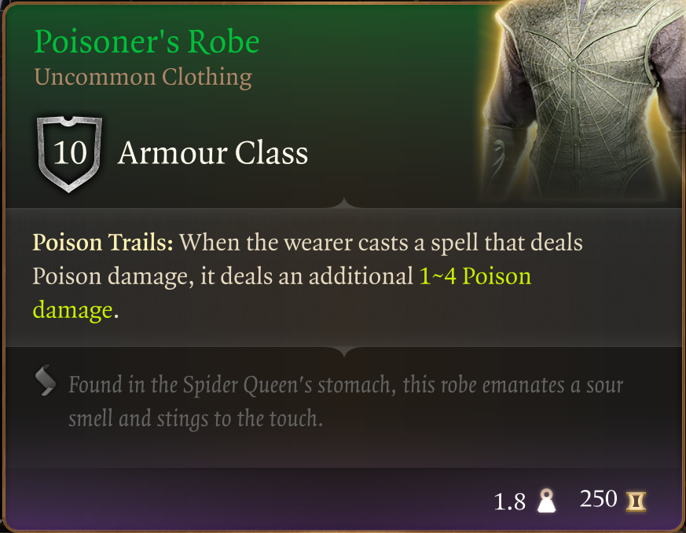
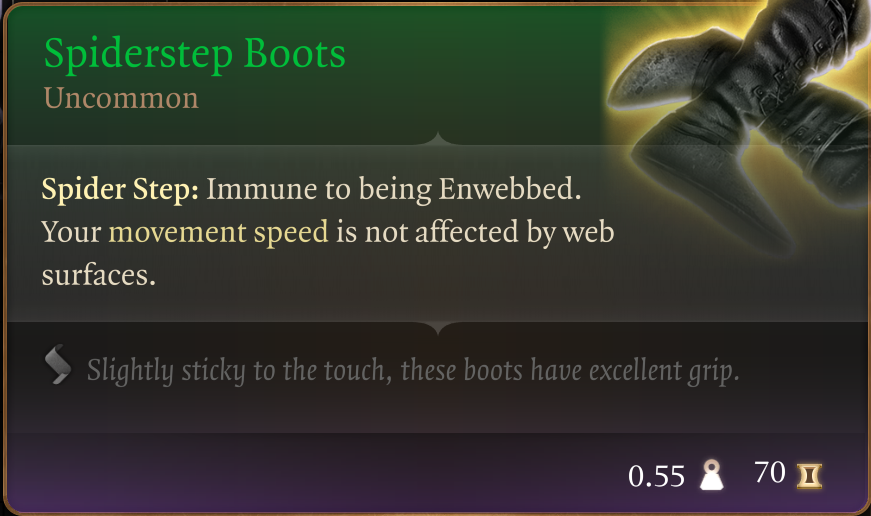
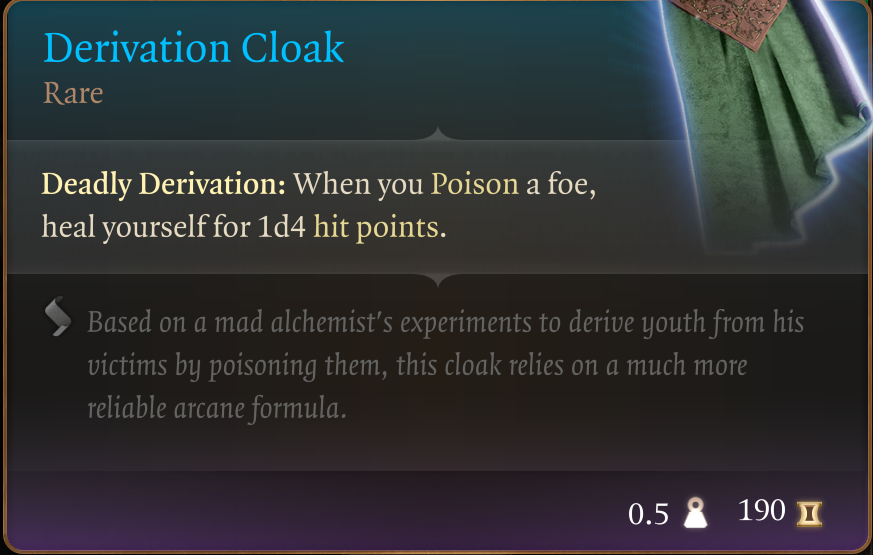
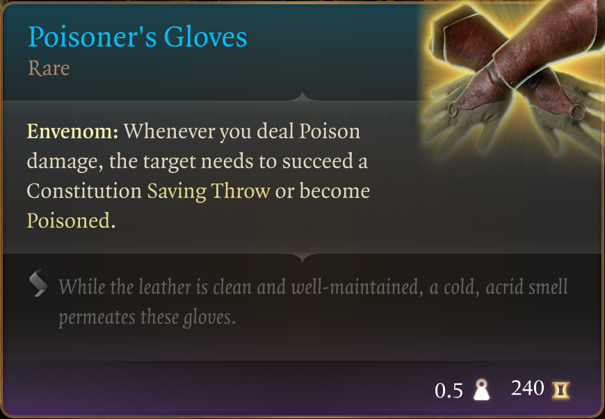
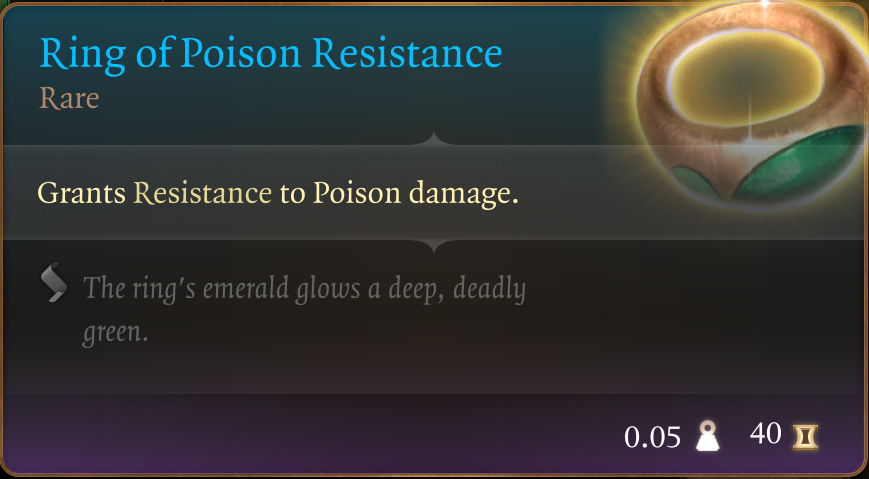
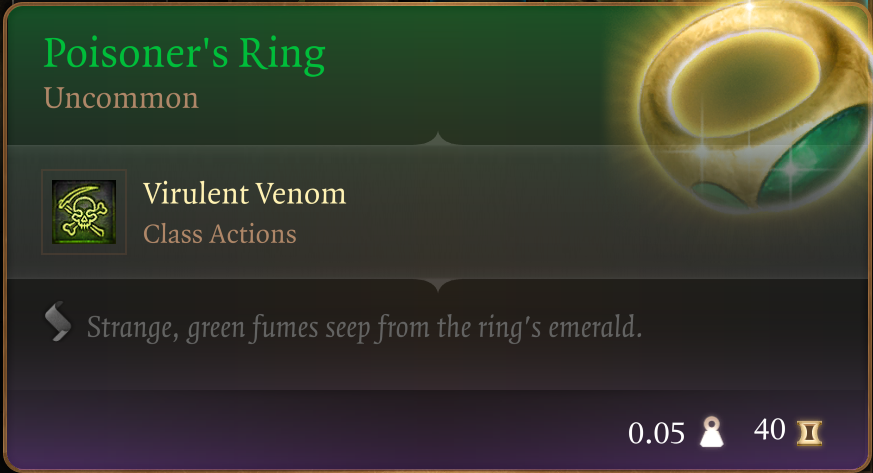
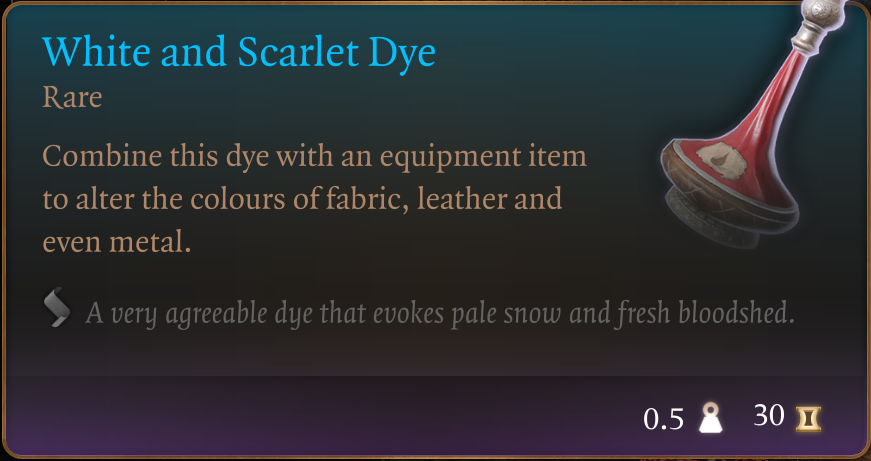
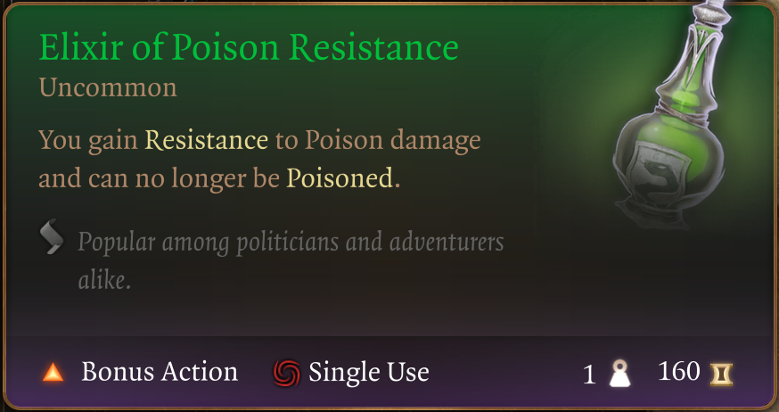
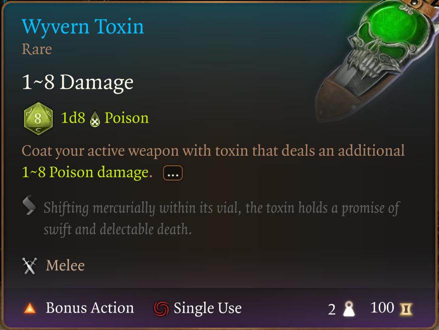

# The Way of The Poisoner

Welcome to my fifth mod in a series that doesn't really have a name :D

I'm trying to provide an enhanced starter experience without tossing the balance too much onto the overpowered side. There are no custom items in these mods, all of the items can be found in the game today. I've just collected them for you.

The theme for this mod should come as no surprise; it's Poison. I've collected what I believe to be a complete (or mostly) list of poison gear from across the early game, and conveniently packaged it up for you in the Tutorial Chest.

I've also included a stack of thematically appropriate dyes for your convenience.

This mod introduces a new pack in the Tutorial Chest, a backpack named "The Way of the Poisoner". Inside it you will find the following items:

## Broodmother's Revenge

## Poisoner's Robe

## Spiderstep Boots - you probably grew up in a spider's lair :D

## Derivation Cloak

## Poisoner's Gloves

## Ring of Poison Resistance

## Poisoner's Ring

## Black and Summer Green Dye

## Elixir of Poison Resistance

## Wyvern Toxin

The Wyvern Toxin might be a little bit too much for the very early game. If this worries you, leave it in the bag :-)

That's it, that's the mod. Enjoy!
