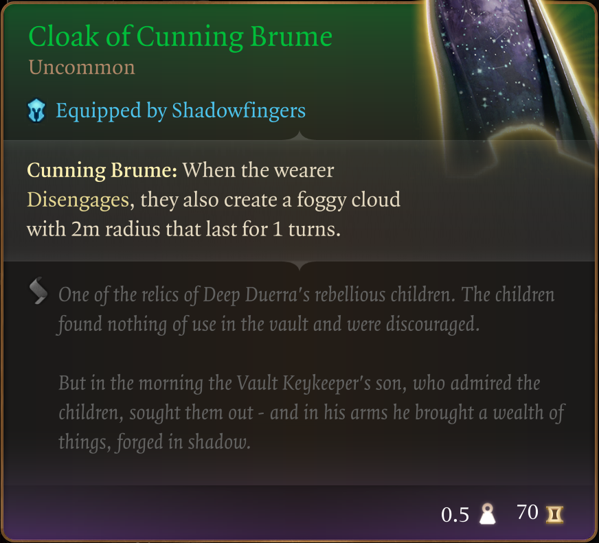

# The Way of The Thief

Published on Nexus Mods: [The Way of The Thief](https://www.nexusmods.com/baldursgate3/mods/3421)

Welcome to my second mod in a series that doesn't really have a name :D

I'm trying to provide an enhanced starter experience without tossing the balance too much onto the overpowered side. Every item you find in this mod already exists in game and can be found "reasonably early on". So no end game Act 3 weapons and gear here - although some of the items might actually last you all the way to the end game.

As the title suggest, the items in this collection are thief oriented. Hiding in shadows, self-service checkout at the local vendors, a life of crime. Sound like just what you need?  Well this mod is for you.  

I've played rogue/thief before and what annoyed me the most was, that they take a fair amount of gear to set up and get working. All of it early game gear for sure, but you still have to play around for quite some time as this thief-but-not-really hybrid until you get it all together.

This mod introduces a new pack in the Tutorial Chest, a backpack named "The Way of the Thief". Inside it you will find the following items:

## The Shadow of Menzoberranzan

## Spidersilk Armour

## Drew Leather Boots

## Gloves of Thievery

## Cloak of Cunning Brume

## Shapeshifter's Boon Ring

## Smuggler's Ring

## Ritual Dagger

You'll notice, the focus is on thief here. Often this class will be combined with e.g. Rogue for an assassin type build, or Monk as a... erm... Shadow Monk type build - I might or might not make packs for that at some point. For for now, this is it. This is the mod.